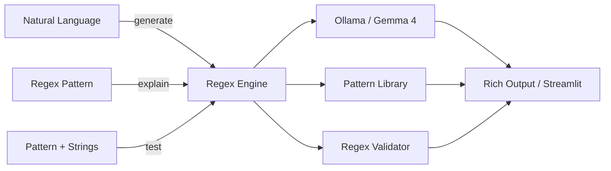

<div align="center">

<br/>


<br/><br/>
<strong>Part of <a href="https://github.com/kennedyraju55/90-local-llm-projects">90 Local LLM Projects</a> collection</strong>
</div>
<br/>

---

## 🏗️ Architecture



```
┌──────────────┐     ┌───────────────┐     ┌─────────────┐
│  CLI / Web   │────▶│  Core Engine   │────▶│  Ollama API │
│  • generate  │     │  • generate    │     │  (Gemma 4)  │
│  • explain   │     │  • explain     │     └─────────────┘
│  • test      │     │  • validate    │
│  • library   │     │  • library     │
└──────────────┘     └───────────────┘
                            │
                     ┌──────▼──────┐
                     │  Utilities  │
                     │  • test     │
                     │  • validate │
                     │  • extract  │
                     │  • highlight│
                     └─────────────┘
```

## ✨ Features

| Feature | Description |
|---------|-------------|
| ✨ **Natural Language → Regex** | Describe what you want to match, get a working pattern |
| 📖 **Pattern Explanation** | Component-by-component breakdown of any regex |
| 🧪 **Live Regex Tester** | Test patterns against strings with match highlighting |
| 📚 **Pattern Library** | 12+ pre-built patterns (email, URL, IP, phone, UUID, etc.) |
| 🌐 **Multi-Flavor Support** | Python, JavaScript, PCRE, POSIX, Java, .NET, Go, Rust |
| ✅ **Pattern Validation** | Instant validation with group count and error details |
| 🔍 **Match Extraction** | See all matches, groups, and positions |
| 🌐 **Streamlit Web UI** | Interactive web interface with generate, explain, and test tabs |
| ⚙️ **YAML Configuration** | Flexible config with environment variable overrides |
| 🎨 **Rich Terminal** | Beautiful colored CLI output with tables |

## 📸 Screenshots
<div align="center">
<table>
<tr>
<td></td>
<td></td>
</tr>
<tr><td align="center"><em>CLI Interface</em></td><td align="center"><em>Streamlit Web UI</em></td></tr>
</table>
</div>

## 📦 Installation

```bash
cd 24-regex-generator
pip install -r requirements.txt
pip install -e .

ollama serve && ollama pull gemma4
```

## 🚀 CLI Usage

```bash
# Generate from natural language
python -m regex_gen.cli generate "email addresses"
python -m regex_gen.cli generate "US phone numbers" --flavor javascript

# Generate and test
python -m regex_gen.cli generate "IPv4 addresses" -t "192.168.1.1" -t "invalid"

# Explain a pattern
python -m regex_gen.cli explain "[a-z]+@[a-z]+\.[a-z]{2,}"

# Test a pattern
python -m regex_gen.cli test "\d{3}-\d{4}" "555-1234" "hello" "123-4567"

# Browse pattern library
python -m regex_gen.cli library
python -m regex_gen.cli library email
```

## 🌐 Web UI Usage

```bash
streamlit run src/regex_gen/web_ui.py
# Open http://localhost:8501
```

## 📋 Example Output

```
╭──────────────────────────────────────────────╮
│  🔤 Regex Generator                          │
│  Generate regex from natural language         │
╰──────────────────────────────────────────────╯

Description: "email addresses"
Flavor: python

╭── 🎯 Generated Regex ───────────────────────╮
│ Pattern: [a-zA-Z0-9._%+-]+@[a-z.-]+\.[a-z]+ │
│                                              │
│ Components:                                  │
│ • [a-zA-Z0-9._%+-]+ - Username part         │
│ • @                  - Literal at symbol     │
│ • [a-z.-]+           - Domain name           │
│ • \.[a-z]+           - TLD extension         │
╰──────────────────────────────────────────────╯

┌──────── Pattern: \S+@\S+\.\S+ ──────────────┐
│ String          │ Matches │ Match Text       │
│ user@example.co │ ✅      │ user@example.co  │
│ invalid         │ ❌      │ -                │
└──────────────────────────────────────────────┘
```

## 🧪 Testing

```bash
python -m pytest tests/ -v
python -m pytest tests/ -v --cov=src/regex_gen --cov-report=term-missing
```

## 📁 Project Structure

```
24-regex-generator/
├── src/regex_gen/
│   ├── __init__.py          # Package metadata
│   ├── core.py              # Generation, explanation, library
│   ├── cli.py               # Click CLI interface
│   ├── web_ui.py            # Streamlit web interface
│   ├── config.py            # Configuration & pattern library
│   └── utils.py             # Testing, validation, extraction
├── tests/
│   ├── __init__.py
│   ├── test_core.py         # Core logic tests
│   └── test_cli.py          # CLI tests
├── config.yaml              # Default configuration
├── setup.py                 # Package setup
├── requirements.txt         # Dependencies
├── Makefile                 # Dev commands
├── .env.example             # Environment template
└── README.md                # This file
```

## ⚙️ Configuration

```yaml
model: "gemma4"
temperature: 0.3
max_tokens: 2048
default_flavor: "python"
```

## 🤝 Contributing

1. Fork → Branch → Commit → Push → PR

## 📄 License

Part of [90 Local LLM Projects](../README.md). See root [LICENSE](../LICENSE).

## ⚙️ Requirements

- Python 3.10+
- Ollama running locally with Gemma 4 model
